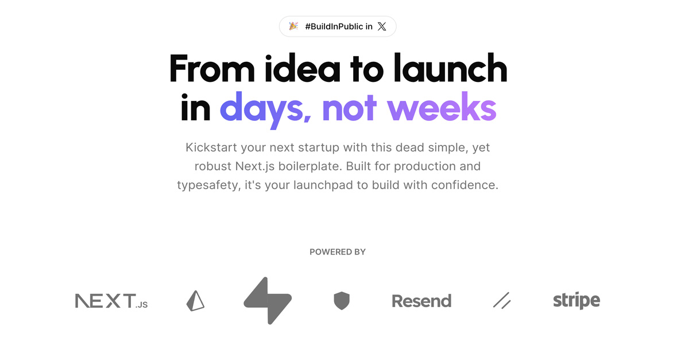

<a href="https://next-saas-stripe-starter.vercel.app">
  
  <h1 align="center">Next.js SaaS Template made Simple and Safe.</h1>
</a>

<p align="center">
  Go from Idea to Launch over a weekend!
</p>

<p align="center">
  <a href="https://twitter.com/miickasmt">
    
  </a>
</p>

<p align="center">
  <a href="#introduction"><strong>Introduction</strong></a> ·
  <a href="#installation"><strong>Installation</strong></a> ·
  <a href="#tech-stack--features"><strong>Tech Stack + Features</strong></a> ·
  <a href="#author"><strong>Author</strong></a> ·
  <a href="#credits"><strong>Credits</strong></a>
</p>
<br/>

## Introduction

Empower your next project with the stack of Next.js 14, Prisma, Supabase, Auth.js v5, Resend, React Email, Shadcn/ui, and Stripe.
<br/>

## Installation

Clone & create this repo locally with the following command:

```bash
npx create-next-app my-saas-project --example "https://github.com/mickasmt/next-saas-stripe-starter"
```

1. Install dependencies using npm:

```sh
npm install
```

2. Copy `.env.example` to `.env.local` and update the variables.

```sh
cp .env.example .env.local
```

3. Start the development server:

```sh
npm run dev
```

> [!NOTE]  
> I use [npm-check-updates](https://www.npmjs.com/package/npm-check-updates) package for update this project.
>
> Use this command for update your project: `ncu -i --format group`

> [!WARNING]  
> You need update `.react-email` folder before use `npm run email`. Check the link [here](https://github.com/resend/react-email/issues/868#issuecomment-1828411325) if you have the error : `renderToReadableStream not found`
>

## Roadmap

- [x] ~Fix Vaul drawer for mobile sign in~
- [x] ~Update OG image~
- [x] ~Add Server Actions on billing form (stripe)~
- [x] ~Add Server Actions on user name form~
- [x] ~Upgrade Auth.js to v5~
- [x] ~Add Supabase as database~
- [x] ~Switch subscription plan (enable on stripe dashboard)~
- [ ] Update documentation for installation & configuration (work on it)
- [ ] Upgrade eslint to v9
- [ ] Add resend for success subscriptions

## Tech Stack + Features

https://github.com/mickasmt/next-saas-stripe-starter/assets/62285783/828a4e0f-30e3-4cfe-96ff-4dfd9cd55124

### Frameworks

- [Next.js](https://nextjs.org/) – React framework for building performant apps with the best developer experience
- [Auth.js](https://authjs.dev/) – Handle user authentication with ease with providers like Google, Twitter, GitHub, etc.
- [Prisma](https://www.prisma.io/) – Typescript-first ORM for Node.js
- [React Email](https://react.email/) – Versatile email framework for efficient and flexible email development

### Platforms

- [Vercel](https://vercel.com/) – Easily preview & deploy changes with git
- [Resend](https://resend.com/) – A powerful email framework for streamlined email development
- [Supabase](https://supabase.com/) – Supabase is an open source Firebase alternative with a generous free tier.

### UI

- [Tailwind CSS](https://tailwindcss.com/) – Utility-first CSS framework for rapid UI development
- [Shadcn/ui](https://ui.shadcn.com/) – Re-usable components built using Radix UI and Tailwind CSS
- [Framer Motion](https://framer.com/motion) – Motion library for React to animate components with ease
- [Lucide](https://lucide.dev/) – Beautifully simple, pixel-perfect icons
- [`next/font`](https://nextjs.org/docs/basic-features/font-optimization) – Optimize custom fonts and remove external network requests for improved performance
- [`ImageResponse`](https://nextjs.org/docs/app/api-reference/functions/image-response) – Generate dynamic Open Graph images at the edge

### Hooks and Utilities

- `useIntersectionObserver` – React hook to observe when an element enters or leaves the viewport
- `useLocalStorage` – Persist data in the browser's local storage
- `useScroll` – React hook to observe scroll position ([example](https://github.com/mickasmt/precedent/blob/main/components/layout/navbar.tsx#L12))
- `nFormatter` – Format numbers with suffixes like `1.2k` or `1.2M`
- `capitalize` – Capitalize the first letter of a string
- `truncate` – Truncate a string to a specified length
- [`use-debounce`](https://www.npmjs.com/package/use-debounce) – Debounce a function call / state update

### Code Quality

- [TypeScript](https://www.typescriptlang.org/) – Static type checker for end-to-end typesafety
- [Prettier](https://prettier.io/) – Opinionated code formatter for consistent code style
- [ESLint](https://eslint.org/) – Pluggable linter for Next.js and TypeScript

### Miscellaneous

- [Vercel Analytics](https://vercel.com/analytics) – Track unique visitors, pageviews, and more in a privacy-friendly way

## Author

Created by [@sreenington] (https://twitter.com/sreenington)

## Credits

This project was inspired by Antonio Erdeljac's [ShipFa.st](https://www.youtube.com/@marc-lou), and Joscha Neske's [JoshTriedCoding] (https://www.youtube.com/@joshtriedcoding)

- Shadcn ([@shadcn](https://twitter.com/shadcn))
- Steven Tey ([@steventey](https://twitter.com/steventey))
- Antonio Erdeljac ([@YTCodeAntonio](https://twitter.com/AntonioErdeljac))
